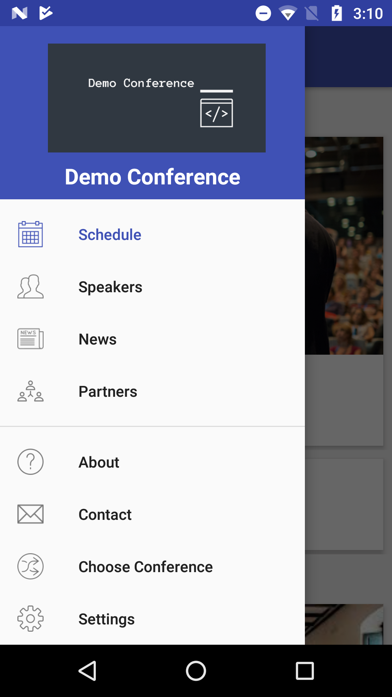
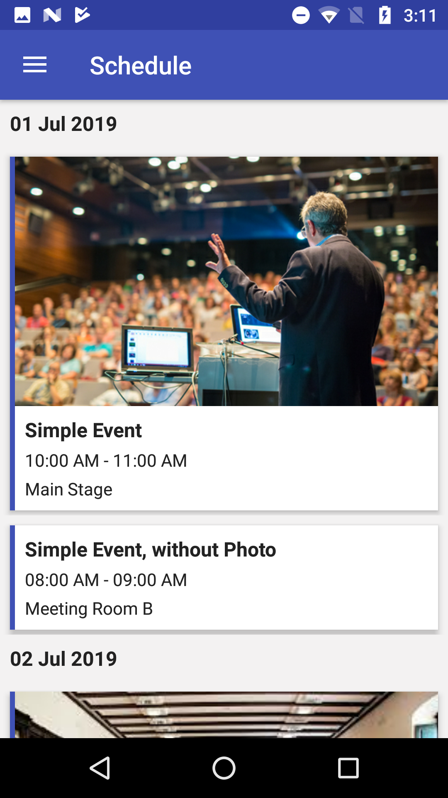

# Conference Application
A customizable conference application written in Kotlin and backed with Firebase Firestore

## Google Play Store
This app is available on the Google Play Store here: https://play.google.com/store/apps/details?id=com.robinkanatzar.conference&hl=en

## Configuration
* Create a new Firebase project. See Firebase documentation: https://firebase.google.com/docs/android/setup
* Add the Firebase config file to the Android project
* Add top level collections for: schedule, speakers, news, partners, about, contact, conferences
